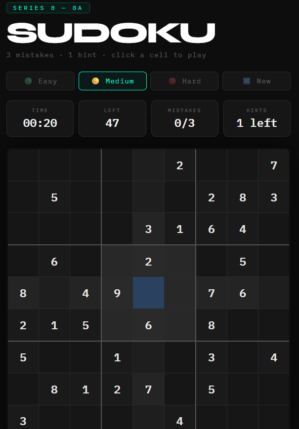

# Sudoku Engine
### Series 8 - Project 8a

A fully playable Sudoku game with a built-in solver and puzzle generator. Generates unique puzzles at 3 difficulty levels using a backtracking algorithm, no external libraries used.

<br>

<a href="https://viditsinghal2406-dotcom.github.io/s8a_sudoku_engine">
  
</a>

<br>

**[▶ Play Live](https://viditsinghal2406-dotcom.github.io/s8a_sudoku_engine)**

---

## Features

- 3 difficulty levels, Easy, Medium, Hard
- Guaranteed unique solution for every generated puzzle
- Click any cell to place a number via numpad
- Row, column and 3x3 box highlighting on cell select
- Same-number highlighting across the board
- 3 mistake limit, permanent, cannot be undone
- 1 hint per game
- Undo support
- Numbers grey out when all 9 are placed
- Win and Game Over screen with stats

---

## How it Works

**Solver** uses recursive backtracking. Tries numbers 1 to 9 in each empty cell, backtracks when no valid number exists.

**Generator** fills a complete board using randomised backtracking, then removes cells one by one. After each removal, checks that exactly one solution remains. If not, the cell is restored.

**Difficulty** is controlled by number of cells removed:

| Level  | Cells Removed | Clues Left |
|--------|--------------|------------|
| Easy   | 32 to 36     | 45 to 49   |
| Medium | 46 to 49     | 32 to 35   |
| Hard   | 52 to 55     | 26 to 29   |

---

## Run Locally

**Web version** - just open `index.html` in any browser.

**CLI version:**
```bash
python sudoku.py            # medium puzzle
python sudoku.py --easy
python sudoku.py --hard
python sudoku.py --solve    # enter your own puzzle to solve
```

No installs needed, pure Python stdlib.

---

## File Structure

```
├── index.html          # web game, deployed on GitHub Pages
├── sudoku_engine.py    # Python logic, solver, generator, validator
├── sudoku.py           # CLI version, playable in terminal
└── README.md
```

---

## Part of Series 8, CORE

22 pure Python projects covering games, finance tools, and utilities.

---

*Built by Vidit Singhal*
